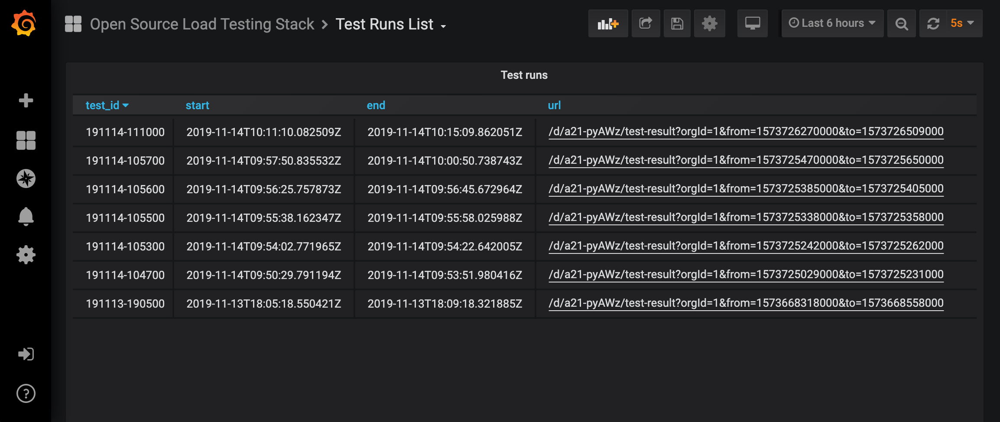
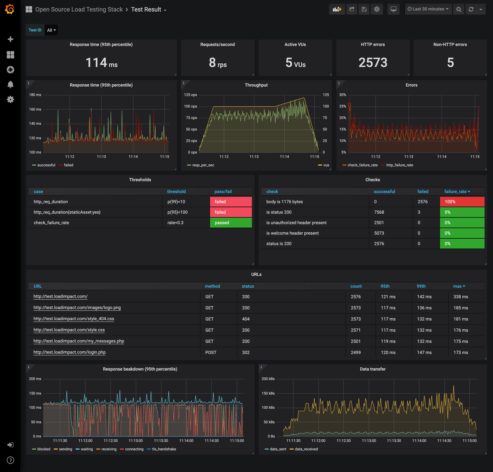

> ### ⚠ ️ This project is no longer maintained in this repository. 
> 
> Development and maintenance have been stopped in this repository. 
> 
> This project is active and maintained at [grafana/xk6-output-timescaledb](https://github.com/grafana/xk6-output-timescaledb).


This project is a stack of open source software that works well together for the purpose of running load tests, storing results and visualizing those results in dashboards. The stack is made up of [k6](https://k6.io/), [TimescaleDB](https://www.timescale.com/) and [Grafana](https://grafana.com/).

# Installation

Note: You must have [Docker](https://docker.com/) installed for running this stack.

To get started with the stack, clone the repo, and run this command in the root of the repo: 
```shell
docker-compose up -d
```

This will spin up a TimescaleDB container and a Grafana container that is provisioned with a data source for connecting to the TimescaleDB database, as well as the pre-built dashboards. Grafana will be available at http://localhost:3000/.

# Usage

To get your first load test running you currently must [build a custom version of k6](https://github.com/loadimpact/k6#build-from-source) from a [PR](https://github.com/loadimpact/k6/pull/1233) that includes the collector for outputting metrics to TimescaleDB.

When you have your custom built k6 ready you'll need to specify that you want the result data output to TimescaleDB like so:

```shell
k6 run -o timescaledb=postgresql://k6:k6@localhost:5432/k6 ...
```

You'll also need to tag your test runs with a `testid` (the value can be whatever you want to use as a unique identifier for test runs like a date string, numeric ID etc.). This tag is what enables the pre-built Grafana dashboards to segment the result data into discrete test runs.

```shell
k6 run -o timescaledb=postgresql://k6:k6@localhost:5432/k6 --tag testid=191114-113000 samples/test.loadimpact.com.js
```

# Dashboards

The stack comes with two pre-built dashboards. One for listing the discrete test runs as a list, and the other for visualizing the results of a specific test run.

## Test list dashboard



## Test result dashboard


